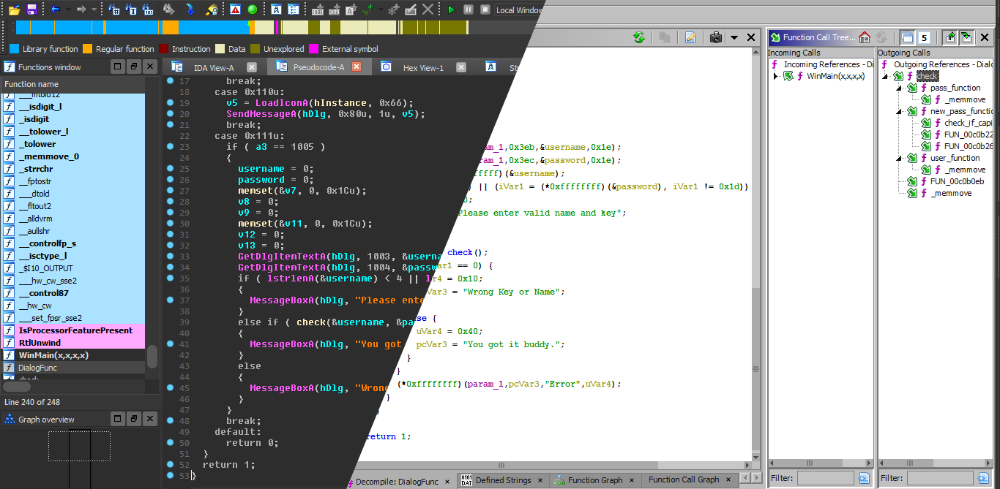
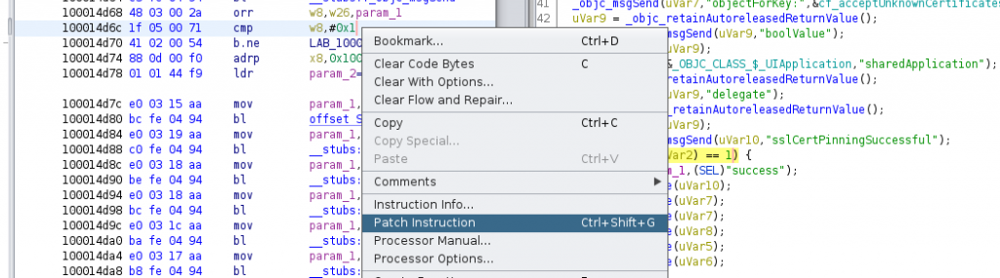
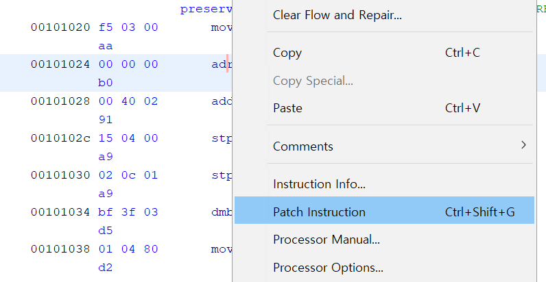
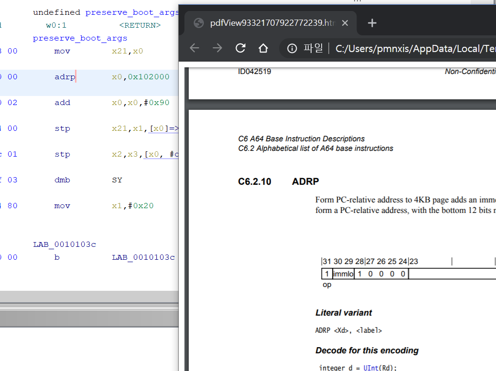
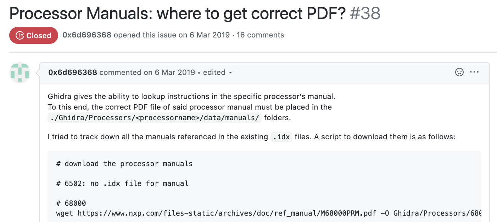
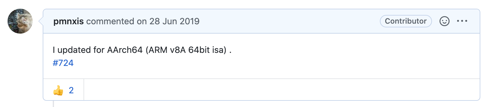
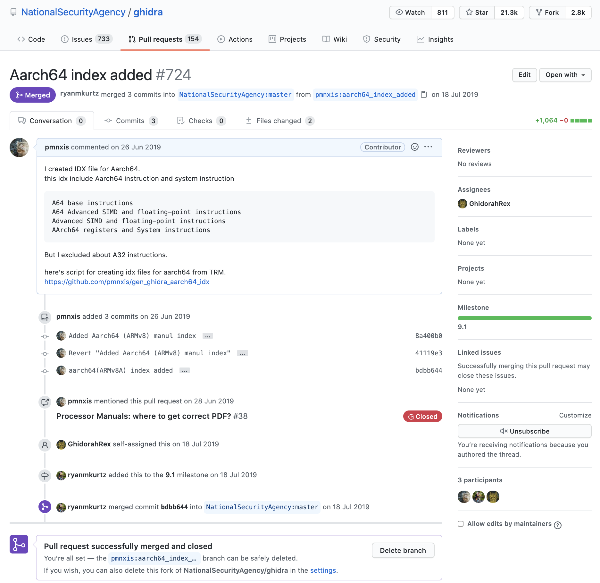
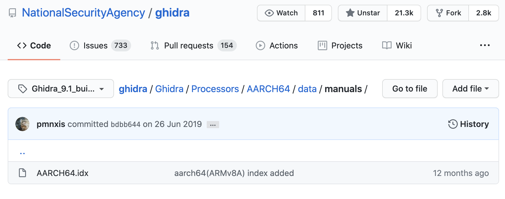

NSA Ghidra AARCH64 Indexing를 기여한 후기
=====================================

## Introduction


*출처 : https://revers3c.blogspot.com/2019/04/import-ida-pro-database-into-ghidra.html*

Ghidra 는 미국 국가안보국(NSA) 내부에서 사용되던 IDA Pro와 같은 정적분석 프로그램(역어셈블러 프레임워크)입니다. 이 프로그램은 2019년 3월 6일 대중에 Github를 통해 공개되었습니다. 저는 리눅스 커널 스터디를 하는 도중 좀 더 쉽게 어셈블리어를 분석하기위해서 Ghidra에 ARM v8A와 관련된 인덱스를 풀 리퀘스트 하였습니다.

https://github.com/NationalSecurityAgency

https://github.com/NationalSecurityAgency/ghidra/pull/724

*이 글은 블로그에 있는 내용을 다시 작성했습니다. 현재 블로그를 사용할 수 없는 상태가 되어 마크다운으로 내용을 다시 옮겼습니다.*

## 기여 계기
IAMROOT 16기(2019년 5월)에 진행된 리눅스 커널 스터디는 ARM v8A에 리눅스 커널 버젼 5.1로 진행하였다.(Ghidra기준 AARCH64 으로 부르며, 리눅스 커널에서는 ARM64로 부름) 리눅스 코드를 Line by line으로 읽는 특성상 ARM v8A의 System Instruction가 섞인 어셈블리 코드를 봤어야 했다.
```
// arch/arm64/kernel/head.S 
// 스터디 내용 일부 발췌
ENTRY(el2_setup)
/*
    SPsel 이 0이면 El0 으로만, 1일경우 1이상의 모든것으로 설정가능.
*/
msrSPsel, #1// We want to use SP_EL{1,2}
/*
    mrs PSR의 내용을 범용 레지스터로 이동
    현재 Exception Level의 값을 General Register인 X0에 이동
*/
mrsx0, CurrentEL
cmpx0, #CurrentEL_EL2
b.eq1f  // 1f는 현재 기준으로 forward로 앞쪽 1

/*
    SCTLR_EL1_RES1_BITUL(11,20,22,28,29)
                    _BITUL(x) (_UL(1) << (x))
    ENDIAN_SET_EL10
    sctrl_el1 은 Exception Level1 용 시스템 컨트롤 레지스터
    isb 는 현재 파이프라인에 들어 있는 명령들을 클리어하고 현재의 컨텍스트로 명령들을 패치.
    msr : Move to system coprocessor register from ARM register.
    SCTLR_EL1, System Control Register, EL1 : The SCTLR_EL1 provides top level control of the system, including its memory system, at EL1 and EL0.
*/
```
이 외에도 커널 코드 특성상 매크로가 많았으며 X86이 아닌 Assembly파일과 C코드가 섞여 있는 문제점으로 스터디 멤버들이 사용하던 Source Insight나 vim(cscope, ctags)로 Assembly에서 C코드나 헤더파일을 타고갈 수 없어, 값을 확인하는 데에 문제가 많았다. 이 과정에서 좀 더 간편화 하기위해 리눅스 커널을 컴파일 한 다음에 Ghidra로 체크하고 앞에서 언급한 ISA도 동시에 확인했다.

코드를 Line By Line으로 보는데 왜 컴파일 해서 굳이 다시 역어셈블리를 하는가. 

에 대한 질문을 할 수 있다. 하지만 Head.S와 같은 코드는 어셈블리 코드이며, 되려 매크로로 이루어진 값을 확인하기 위해서는 이미 컴파일된 결과물을 역어셈블리 하는 것이 빠르다. 매크로를 타고 가서 실제 어셈블리 코드의 결과물은 컴파일러가 하는 것이며 스터디 멤버들의 손과 눈으로 하나하나 보기에는 너무 느렸으며 실제로 우리가 분석한 것이 맞는지 컴파일->역어셈블리를 통해서 확인하는 것이 최적이었다. 따라서 어셈블리 코드를 컴파일해서 역어셈블리하더도 결국 원본 또한 어셈블리코드 이며 매크로들이 실제 값과 명령어로 치환되기에 일부 부분에서는 가독성면에서 이득을 본다. C/CPP코드의 원본과 이를 컴파일한 것을 역어셈블리/디컴파일한 결과와는 매우 다르다.

## 더 나아가 Ghidra의 ISA manual 열람기능과 활용 하려하다.
우리는 어셈블리어를 읽어야만 했다. 허나 이는 임베디드 개발자로서 디버깅을 할 때 극히 드문 상황에 쓰이거나 과거의 최적화 기법으로 치부되거나, 정말 드물게 부트로더 관련 업무를 할때 쓰이는 것으로 숙지한다. 과거 8051를 통한 개발을 어셈블리로 했다는 이야기는 제외하겠다. 결국에는 잘알지 못한다, 그리고 다 Architecture의 TRM을 자주 참조한다.

ARM v8A의 명령어는 2019년 7월 기준으로 1106개 이다. 여기에 ARM v7A에서 계승 된 명령어나 일부 명령어나, Thumb를 제외하고 그 정도이다. 이를 다 알 수 없다. 그리고 ISA를 소개하는 TRM의 PDF는 매우 크기에 노트북에서 열거나 검색하는 데에는 매우 시간이 걸린다.


*출처 : https://mezdanak.de/2019/04/17/ios-patching-security-features-of-mobile-app-with-ghidra/*
```
Target ISA -> Menu -> Processor Manual...
```

운이 좋게도 Ghidra에는 원하는 instruction의 매뉴얼 상에서의 설명을 볼 수 있는 기능이 있다. 하지만 
ARMv8A의 매뉴얼은 이와 같은 기능을 위한 인덱싱이 되어있지 않다. 따라서 새로 인덱싱을 해줄 필요가 있었다.

이를 해결하기위하여 파이썬을 통해 PDF의 목차를 파싱하였으며 수동으로 매뉴얼이 존재하는 영역만 골라내도록 러프하게 구현하여 Ghidra에서 수용할 수 있는 형태로 출력하였다.

실제 이를 생성하는 코드는 Github에 게시해두었다.

https://github.com/pmnxis/gen_ghidra_aarch64_idx

테스트 결과 이와같이 매뉴얼을 잘 띄우고 해당 페이지로 바로 리다이렉트 되는 것을 확인했다.



이 결과로 어셈블리를 찾을 때에 많은 시간을 줄였으며 덕분에 리눅스 커널 스터디의 Head.S를 진행할 때에 많은 도움이 되었다.

## 나의 첫 오픈소스 Pull Request

*https://github.com/NationalSecurityAgency/ghidra/issues/38*

이러한 과정이 있기 전 나는 위에 이슈를 통해서 ARM v7A 명령어는 인덱싱 파일만 제공되며 매뉴얼은 따로 다운로드를 해야 하며 내가 사용해야하는 ARM v8A는 없는 것을 확인했었다. 그리고 내 문제를 해결하고나서는 내 결과물을 올려야겠다고 생각하고 이를 Issue에 알리고 Pull Request를 넣어보았다.




*https://github.com/NationalSecurityAgency/ghidra/pull/724*

그 결과 3주정도가 지나서 커미터는 이를 받아들이고 Master에 merge되었다. 



그리고 내가 기여한 것은 
Ghidra 9.1 build부터 적용되기 시작했다.

이 때 정말 뿌듯하였다. 

나는 군에서 SW개발병으로 복무로 우연하게 임베디드 시스템 보안을 공부하면서 리버싱을 조금 공부하였고 그때 리버싱에는 정말 대단한 해커?만큼의 능력과 타고나거나 오랜 노력으로 만들어진 실력은 없다고 생각했엇다. 하지만 그때 배운 스킬을 영 다른 목적으로 사용을 했었는데 그 중하나가 커널 스터디에서의 어셈블리어 분석이였고 이렇게 끝나나 싶었으나 정보보호관련으로 하나의 정수라 할 수 있는 프로그램에 이렇게라도 기여할 수 있는 기회가 있다는 것에 감사했고 앞으로도 이러한 기회가 있다면 참여를 이어나가야겠다는 생각이 들었다.
